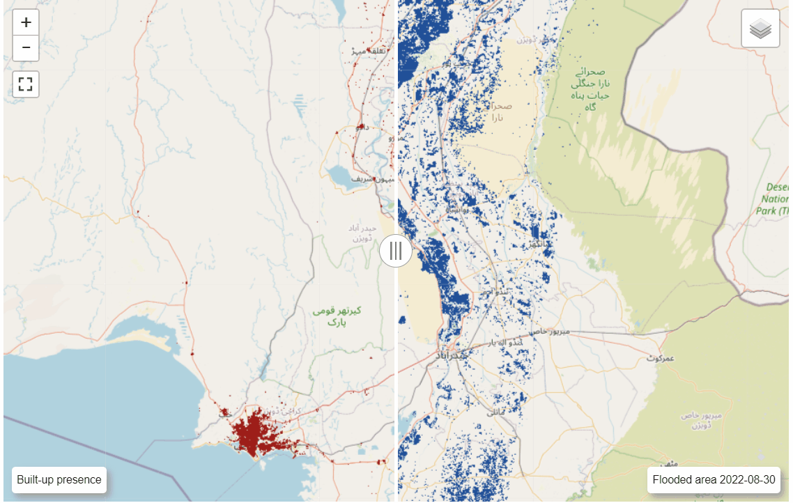

# DestinE_EUMETSAT_PakistanFlood_2022
 Use case demonstration of DestinE Data Lake service for the disaster response assessment following the flood in Pakistan in 2022.

## Demonstration

First the current flood situation is investigated and affected areas are delineated on a map. Data produced by the Global Flood Monitoring (GFM) Service is used to depict the current situation of the 2022-08-18. Affected areas are deduced by incorporating information about build-up surfaces provided by the Global Human Settlement Layer (GHSL).

  
Outputs of the Weather-Induced Extremes Digital Twin, simulated by ERA5 data, are used to forecast future flooded areas.  

The simulated scenario is evaluate based on the observed flood extent 12 days later (2022-08-30). In the following, we can see that the areal extent of flooding dramatically increased.

Details about how the data was produced can be found in the given IPython notebook

## Usage and Limitations
### Run in local JupyterLab
Create a conda/micromamba environmnent and install required packages as given in the conda-env.yml
``
micromamba create -n dedl_usecase -f conda-env.yml --yes
``

### Limitations
To make use of the DEDL Stack Service Dask, a user needs to be registered and granted access with the corresponding DEDL services.

Data used in the demonstration is located in a private bucket.

